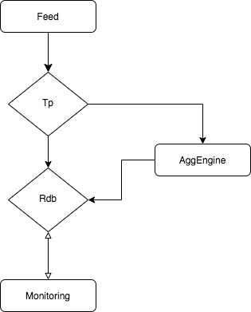
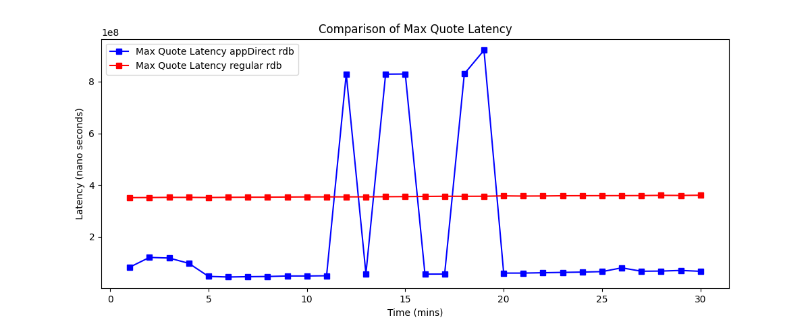
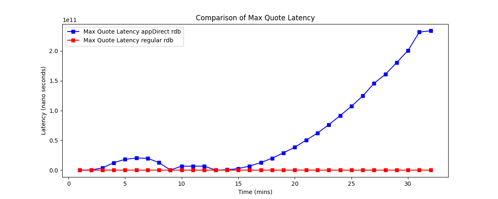

# Expanding Capacity of real time kdb market data stack with optane persistenent memory
by Nick McDaid and Eoin Cunning

## Abstract
- Wrote a test suite to examine the latency of a typical real time kdb solution. To compare and contrast the effects of different volumes of data, throughput rates etc.
- Wrote tools to easily configure the splitting of real time data between dram and optane storage.
- Compared the performance of optane versus regular dram in these scenrios for several combinations of the system varibles mentioned.
- Found that there are scenarios where storing rdb data in optane is a viable option and in these case addition of optane to existing server should expand capicity where using traditional hardware would mean requiring to get additional servers.

#### Table of Contents  

[Intro](#intro)  
[Hardware](#hardware)  
[Testing](#testing)  
[Results](#results)  
[Conclusion](#conclusion)  
[About The Authors](#authors)  

<a name="intro"/>

## Intro/Background
While there has been research published in the kdb community showing the effectiveness of Optane as an extremely fast disk, with the ability to query weeks of data with performance levels approaching that of DRAM (<need to work this better), there as yet, has been no published research using Optane as a volatile memory source. This blog post looks at running the realtime elements of a kdb+ market data stack on Optane Memory, mounted in DAX Enabled App Direct Mode. It also provides a few useful utilities for moving your data into Optane with minimal effort, and it documents the observed performance.

<a name="hardware"/>

## Hardware

-TODO - SHOULD THIS BE AN APPENDIX-
server details TODO Intel can provide more details here on optane and the server set up.

```
|18:05:28|user@clx4:[q]> lscpu
Architecture:        x86_64
CPU op-mode(s):      32-bit, 64-bit
Byte Order:          Little Endian
CPU(s):              56
On-line CPU(s) list: 0-55
Thread(s) per core:  1
Core(s) per socket:  28
Socket(s):           2
NUMA node(s):        2
Vendor ID:           GenuineIntel
CPU family:          6
Model:               85
Model name:          Genuine Intel(R) CPU 0000%@
Stepping:            6
CPU MHz:             2538.054
CPU max MHz:         4000.0000
CPU min MHz:         1000.0000
BogoMIPS:            4400.00
Virtualization:      VT-x
L1d cache:           32K
L1i cache:           32K
L2 cache:            1024K
L3 cache:            39424K
NUMA node0 CPU(s):   0-27
NUMA node1 CPU(s):   28-55
Flags:               fpu vme de pse tsc msr pae mce cx8 apic sep mtrr pge mca cmov pat pse36 clflush dts acpi mmx fxsr sse sse2 ss ht tm pbe syscall nx pdpe1gb rdtscp lm constant_tsc art arch_perfmon pebs bts rep_good nopl xtopology nonstop_tsc cpuid aperfmperf pni pclmulqdq dtes64 monitor ds_cpl vmx smx est tm2 ssse3 sdbg fma cx16 xtpr pdcm pcid dca sse4_1 sse4_2 x2apic movbe popcnt tsc_deadline_timer aes xsave avx f16c rdrand lahf_lm abm 3dnowprefetch cpuid_fault epb cat_l3 cdp_l3 invpcid_single ssbd mba ibrs ibpb stibp ibrs_enhanced tpr_shadow vnmi flexpriority ept vpid fsgsbase tsc_adjust bmi1 hle avx2 smep bmi2 erms invpcid rtm cqm mpx rdt_a avx512f avx512dq rdseed adx smap clflushopt clwb intel_pt avx512cd avx512bw avx512vl xsaveopt xsavec xgetbv1 xsaves cqm_llc cqm_occup_llc cqm_mbm_total cqm_mbm_local dtherm ida arat pln pts hwp hwp_act_window hwp_epp hwp_pkg_req pku ospke avx512_vnni md_clear flush_l1d arch_capabilities
```
### appDirect set up
```
# set all optane to appDirect (DID through bios may not be needed, require reboot)
ipmctl create -goal persistentmemorytype=appdirect

# creating namespace from persistent namespace (align good for pages )
ndctl create-namespace --mode=fsdax --region=0 --align=2M
ndctl create-namespace --mode=fsdax --region=1 --align=2M

# make a file system
mkfs -t xfs /dev/pmem0
mkfs -t xfs /dev/pmem1

# mount file system make writeable
mkdir /mnt/pmem0
mkdir /mnt/pmem1

#This will mount in direct axcess mode
mount -o dax /dev/pmem0 /mnt/pmem0/
mount -o dax /dev/pmem1 /mnt/pmem1/

# sector mode (maybe better to specidfy sector mode)
mount /dev/pmem0 /mnt/pmem0/
mount /dev/pmem1 /mnt/pmem1/

chmod 777 /mnt/pmem0
chmod 777 /mnt/pmem1
```

### Numa settings
The standard [recommendation](https://code.kx.com/q/kb/linux-production/) when using numa is to set --interleave=all                                                                                                                  
` numactl --interleave=all q `
but found better performance in aligning the numa nodes with the persistent memorary namespaces
`numactl -N 0 -m 0  q -q -m /mnt/pmem0/` and `numactl -N 1 -m 1  q -q -m /mnt/pmem1/`

<a name="testing"/>

## Testing Framework - description of testing stack
The Framework designed to test how optane chips can be deployed is a common market data capture solution. Based on the standard [tick setup](https://github.com/KxSystems/kdb-tick)

The traditional bottle neck of market data platforms has been the amount of DRAM on a server, which in turn determines how many RDB's a server can host. There are a number of ways to try and get around this limitation, such as directing users to aggregated services such as second or minute bucketed data where possible, however when a user requires tick by tick precision, there is no other option other routing the query to the raw data in the RDB.

To make sure we really stress tested Optane, we simulated the volume and velocity of market data process during the market crash on March 9th 2020. We prestressed the RDB with 65 million records, and then sent 48,000 updates per second for the next 30 minutes, split between trades and quotes in a 1:10 ratio. A tickerplant consumed this feed and on a 50ms timer, distrubed the messages to an aggregation engine, which generated second  / minute / daily aggregations and published these back to the tickerplant. The RDB consumed all incoming messages. Every 2 seconds our monitor process would query the RDB and measure:
- Max trade / quote latency (time between the tick being generated in the feed process and the tick being accessible via an RDB query)
- Max latency on aggregated quote/ trade message (as above - but also including the time for the aggregation engine to do it's calculations and it's additional messaging hops)
- Time for an asof join of all trades seen for a single symbol and their prevailing quote information
- Various memory stats such as Percent DRAM used and Percent Optane memory used

The above was considered a "stack". We ran four stacks concurrently for our testing. Two fully hosted in DRAM and two with their RDBs hosted in Optane. It's worth nothing for our aggregation engines, we kept all the caches and required data in DRAM as Optane does have I/O restrictions and an engine which is constantly reading and writing small ticks would not be the optimal use case for the technology.




### Feed
Data arrives from a feed. Normally this would be a feedhandler publishing data from exchanges or vendors. For consistent testing we have simulated this feed from another q process. This process generates random data and publishes down stream. For the rate of data to send we looked and the largest day of market activity in 2020. which durring its last half hour of trading before the close consisted of 80,000,000 quote msgs and 15,000,000 trades. Code can be viewed [here](../src/q/feed.q)

### Tp
Standard kdb tp running in batch mode. Code can be viewed [here](../src/q/tp)

### AggEngine
This process is the main departure for standard tick set up. This process subscribes to standard trade and quote tables and calculates running daily and minute level stacks for all symbols. These aggregated tables are then published to the rdb from which they could then be queried.
This process wwas added in order to have some kind of more complex event processs as well as standard rdb. This process will constantly have to read and write to memory. where generally only has to write as it appends data and only read for queries) Code can be viewed [here](../src/q/aggEngine)

### Rdb
Standard rdb subsribes to tables from the tp. We also added option to prestress the memory before our half hour of testing again looking at the market fata on 2020.03.02 there were 650,000,000 quote msgs and 85,000,000 trades at 15:30 so we insert these volumes into the rdb at start up.
This aims to ensure that the ram is already somewhat saturdated. [here](../src/q/tp)

### Monitor
The Monitor process connects to the rdb and collect performance stats on a timer. Main measurements are for latency of quote table this will track if messages getting queued from the tp, quote stats table if this falls behind indicates issue in aggEngine and the query time which measures how long it takes to run some typical rdb queries .e.g aj
On start up this process also kicks off the feed once having succsesfully connected to rdb to start testing run.
Once endTime has been reached the stats collected are aggregated and written to csv. [here](../src/q/monitorPerf.q)

<a name="results"/>

## Findings/Results

This test was run with ticker plant in a 1s batch publish mode. And Querys hitting the rdbs every 2 seconds.



In this case although we see spikes in the maximium latency for the appDirect rdb.
The latency remains very small through out. And is able to keep ingesting data from the tp without falling behind.

The issue is whenever we decrease the batching and the query the rdb more regularly. Simulating a more latency sensitive system
Here the tp was publish in 50ms batchs and querys running on rdbs every 1 second.



We can see now that the appDirect rdb falls very far behind compared to the DRAM rdb.

<a name="conclusion"/>

## Conclusion
- It is possible to run rdbs with data stored in optane instead of dram. Code required for such changes is outlined.
- There is a trade off in performance for querying from persistent memory. can be seen to be 2-5x slower.
- Possible that just trying to convert a working hdb to optane. This slow down in read speed will cause queries to take longer and could result in rdb delaying processing of of new messages for tp.
- If a rdb is already seeing very high query volumes may not be advisable to move everything to optane mem.
- More realistic use case is if you have columns that are seldom queried even only adhocly that subset of columns could be moved to .m namespace freeing up ram for more rdbs.

While it isn't primarily marketed as a DRAM replacement technology, we found it was a very helpful addition in augmenting the volatile memory capacity of a server hosting realtime data.

### Steps for further investigation or post could involve
- enhancing query testing, have load balancer infront of rdbs and compare replacing 1 dram rdb with 3 optane rdbs. Ensure latency not an issue due to write contention and confirm that query impact not affect slow down mitagated by extra services available to run them.

<a name="authors"/>

## About the authors
