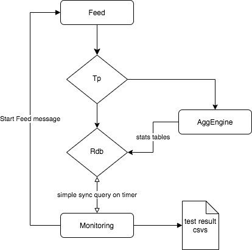

# Using Intel® Optane™ memory to expand the capacity of a typical realtime kdb+ market data system<!-- omit in toc -->

[by Eoin Cunning and Nick McDaid](#about-the-authors)

## Abstract<!-- omit in toc -->

- Wrote a testing framework to simulate a realtime kdb+ market data system and measure latency within the system.
- Benchmarked DRAM vs Optane memory when processing US equity data for one of the busiest days in 2020
- Wrote utility script to easily move in-memory data between DRAM and Optane memory
- Found that:
  - Optane is a viable solution to augment the realtime capacity of a kdb+ system
  - Optane allows better utiliation of existing hardware where DRAM was previously a limiting factor

## Table of Contents<!-- omit in toc -->

- [Background](#background)
- [Kdb+ Utility Functions for Optane Memory](#kdb-utility-functions-for-optane-memory)
- [Testing Framework](#testing-framework)
- [Results and Discussion](#results-and-discussion)
  - [Test Case 1](#test-case-1)
    - [Results](#results)
    - [Analysis](#analysis)
  - [Test Case 2](#test-case-2)
    - [Results](#results-1)
    - [Analysis](#analysis-1)
- [Conclusion](#conclusion)
- [About the authors](#about-the-authors)
- [Appendix](#appendix)

## Background

While there has been research published in the kdb+ community showing the effectiveness of Optane as an extremely fast disk in both a [financial use case](https://kx.com/blog/overcoming-the-memory-challenge-with-optane) and also being used with [sensor data](https://code.kx.com/q/architecture/optane-tests/), there as yet, has been no published research using Optane as a volatile memory source.

Traditionally the choke point of a market data platform has been the amount of DRAM available on a server, which determines how many RDBs can be run to server queries for todays data.

This blog:

- Looks at wether Optane mounted in [AppDirect mode](https://code.kx.com/q/kb/optane/#app-direct-mode) can be used to help solve this problem
- Provides useful utilities to move data in and out of Optane memory
- Documents the observed performance

It is assumed the reader already has some knowledge of kdb+ and Optane. This paper contains some details on how to use Optane but a lot more detail is available [here](https://code.kx.com/q/kb/optane) on the Kx wiki. A good tech talk is also available from [AquaQ](https://www.aquaq.co.uk/q/aquaquarantine-kdb-tech-talks-2/#optane).

This paper was produced in partnership with Intel, so focuses on Optane memory, but the concept is interchangeable with other filesystem backed memory sources.

## Kdb+ Utility Functions for Optane Memory

Optane memory is accessible in kdb+ by use of the [-m command line option](https://code.kx.com/q/basics/cmdline/#-m-memory-domain) and the [`.m` namespace](https://code.kx.com/q/ref/dotm/). To move data into Optane simply define it in the `.m` namespace. No other code changes are required. This can be accomplished by using the following two functions from the [mutil.q](../src/q/mutil.q) script.

```q
// ex .mutil.colsToDotM[`trade;`price`size]
.mutil.colsToDotM:{[t;cs] 
    // enusre cs is list
    cs,:();
    // pull out columns to move an assign in .m namespace
    (` sv `.m,t) set ?[t;();0b;cs!cs];
    // replace columns in table
    t set get[t],'.m[t];
    };   

.mutil.tblToDotM:.mutil.colsToDotM[;()];
```

The only difference between running a DRAM and Optane RDB is starting it with the `-m` option pointing to an Optane mount and running the following command after loading the  schema:

```q
.mutil.tblToDotM each tables[];
```

Using `.mutil.colsToDotM` rather than `.mutil.tblToDotM` allows users to move a subset of columns into Optane, giving a hybrid model which allows users to keep their most accessed columns in DRAM and less accessed columns in Optane.

## Testing Framework

The framework was designed to mimic a typical kdb+ market data capture platform and then observe and record system latency. A command line flag would tell the framework if it should start its RDB in DRAM or Optane.  The capture section of the framework is largely base on the standard [tick architecture](https://github.com/KxSystems/kdb-tick)

The framework simulates the volume and velocity of market data processed on March 9th 2020. It prestressed the RDB with 65 million records, and then sends 48,000 updates per second for the next 30 minutes, split between trades and quotes in a 1:10 ratio.

A tickerplant (tp) consumed this feed and on a timer distributed the messages to an aggregation engine which aggregated stats to a minute and daily level before publishing them back to the tickerplant. The RDB consumes the raw and aggregated data. On a separate configurable timer, the monitor process queries the RDB and measures all of the below, considered to be a "typical kdb+ query":

- Max trade / quote latency (time between the tick being generated in the feed process and being accessible via a query to the RDB)
- Max aggregated trade / quote stats latency (as above - but also including the time for the aggregation engine to perform it's calculations and publish the results)
- Number of records in each table
- Time taken to get the prevailing quote information for every trade for a single ticker
- Memory utilisation stats

The above was considered a "stack". The testing consisted of running multiple stacks with their RDB hosted in either DRAM or Optane and varying the tickerplant publish / query request frequencies to determine the maximum number of the "typical kdb+ queries" the system could server and the max latency in each setup.

A more detailed description of the [architecture](#testing-framework-architecture) can be found in the appendix.

## Results and Discussion

### Test Case 1

Run two DRAM RDBs and two Optane RDBs. Volume of data being published is constant but TP and query frequencies are altered to compare latency and check if RDBs can respond to queries at the same rate that they are received.

#### Results

Tickerplant publish frequency 50ms

Monitor query frequency: 300ms

|        Stat            |  DRAM         | Optane     | Comparison<sup>1</sup>|
| :----------------------|--------------:| ----------:| -----------:|
| Max Latency            |  00:00.0365   | 00:00.0599 | 0.6097      |
| Memory Usage MB        |  171,893      | 5.766      | 29814       |
| Average Query Time     |  00:00.0471   | 00:00.0678 | 0.6946      |
| Queries per minute     |  200          | 200        | 1           |

Tickerplant publish frequency 50ms

Monitor query frequency: 50ms

|        Stat            |  DRAM       | Optane     | Comparison<sup>1</sup>|
| :----------------------|------------:| ----------:| -----------: |
| Max Latency            | 00:00.1252  | 04:45.2034 | 7.320e-06    |
| Memory Usage MB        | 171,893     | 5.766      | 29814        |
| Average Query Time     | 00:00.0506  | 00:00.0698 | 0.7254       |
| Queries per minute     | 880         | 600        | 0.6818       |

Tickerplant publish frequency 1000ms

Monitor query frequency: 50ms

|        Stat            |  DRAM       | Optane     | Comparison<sup>1</sup>|
| :----------------------|------------:| ----------:| -----------:|
| Max Latency            |  00:01.0541 | 00:01.0379 | 0.9846      |
| Memory Usage MB        |  171,893    | 5.766      | 29814       |
| Average Query Time     |  00:00.0476 | 00:00.0678 | 0.7016      |
| Queries per minute     |  1080       | 600        | 0.55        |

Tickerplant publish frequency 50ms

Monitor query frequency: 20ms

|        Stat            |  DRAM       | Optane     |Comparison<sup>1</sup>|
| :----------------------|------------:| ----------:| ----------: |
| Max Latency            |  01:17.5857 | 14:29.5256 | 0.08862     |
| Memory Usage MB        |  171,888    | 5.766      | 29813       |
| Average Query Time     |  00:00.0500 | 00:00.0704 | 0.7107      |
| Queries per minute     |  1000       | 700        | 0.7         |

<sup>1</sup>Comparison is factor. Higher is better. Factor of 1 = same performance. Factor of 2 = twice as fast or half the memory used.

#### Analysis

- Max latency is as expected, consistently higher in the Optane RDBs. (1-14x more)
- As query frequency increases, Optane and DRAM both see latency increase but Optane struggles more.
- By increasing the TP timer and allowing larger writes, the impact of slower read / writes in Optane can be reduced. (Note the 1 second max latency is due to data being published on a 1s timer).
- The number of queries per minute supported in Optane was significantly less than DRAM in a number of situations so isn't a like for like replacement, but does offer great potential to augment DRAM capacity.
- It's worth noting that Queries per minute are based off being run on a timer. They are not the limit of the number of queries that can be run. There is a theoretical limit to how many quires could be run to how many could run per minute for each timer freq. (Minute / query frequency)

The trade off in latency and max queries per minute is the compromise for a massive reduction in memory usage. This is expected though given the IO overhead of Optane vs DRAM.

### Test Case 2

Comparing two DRAM RDBs versus ten Optane  RDBs, 1s TP publish frequency and query frequency of 50ms.
Again recording latency of systems but also the sum max number of queries achievable across all RDB instances to attempt to model performance achievable with a perfect load balancer.

#### Results

|                                 | 2 DRAM RDBs  | 10 Optane RDBs | Comparison<sup>1</sup>|
| :-------------------------------|-------------:|---------------:| -----------:|
| Max Latency                     | 00:01.04238  | 00:01.0709     | 0.9734   |
| % Memory of DRAM used on server | 63.2989      | 2.25653        | 28.0514  |
| Average Query Time              | 00:00.04672  | 00:00.0678     | 0.6889   |
| Max queries per minute          | 2314         | 7735           | 3.4327   |

<sup>1</sup>Comparison is factor. Higher is better. Factor of 1 = same performance. Factor of 2 = twice as fast or half the memory used.

#### Analysis

- Max latency of two systems is comparable.
- Percentage memory usage is almost negligible for 10 Optane RDBs vs the 2 DRAM RDBs are using most of memory on the box.
- Average query time is slower in Optane but due to extra RDB services being available, the total queries per minute possible is increased.

DRAM will excel when compared like for like with Optane, however Optane is better suited to horizontal scaling. The test server could host up to ten Optane RDBs compared to two Standard RDBs with the same amount of data.

## Conclusion

From this analysis, Optane is a viable option to help augment the DRAM capacity of a realtime market data system with minimal code changes required, with the caveat that performance difference will vary depending on the type of queries the user is running. Queries which have small reads and then large computes will have less noticeable impact running on Optane vs queries which need to read full vectors of data such as `select max price by sym from table`. In side testing, it was observed operations such as these could be 3-5x slower than DRAM.

A simple load balancer may result in inconsistent query times for users, however many kdb+ IPC frameworks now have the ability to add different queries to different priority queues depending on query / user characteristics. In these instances, routing high priority traffic to DRAM RDBs and less time critical queries to Optane RDBs would be a great way to use the additional capacity.

It is worth noting that Optane performance wont scale linearly. The ten Optane RDBs were spread across two cards. From discussions with the team at Intel, they expect each card should support up to five concurrent reads or writes before IO contention becomes an issue. The testing which was carried out with NUMA / taskset settings configured to ensure each RDB was locked to the optimal cards and CPU. More details of which are available in the [appendix](#appendix).

A great use of Optane could be moving less frequently used columns out of DRAM and into Optane using a util such as `.mutil.colsToDotM`. Many systems have a number of timestamps which are only ever used to forensically examine a production issue such as misaligned / late data. Many users drop these columns from the RDB insert and need to replay the TP log to access them during a production issue. Keeping them in Optane would allow instant access during given issues.

Regarding costs, while Optane is cheaper than DRAM, it is worth noting that older servers won't support it. Therefore it is not a magic bullet for older struggling systems as a newer server will also be required. Severs with 48+ CPU's that are currently using 70-80% of their DRAM but maybe only 30-40% of their CPU could also see better CPU utilisation of their existing hardware with Optane as they can host more data to crunch on a single server rather than having to buy a second one and only use 30-40% of CPU there also

At the time of writing it is also not available on any of the major cloud providers. But it's due to be on the 2021 road map for a number of providers.

Ideas for future testing:

- Using Optane to load reference data into processes. At present there are use cases where users call out to a reference data service to map securities, corporate actions etc. These data sets can be tens of GB's of data. While it is not practical to hold this data in DRAM in many processes, Optane could present an opportunity to load this data into the `.m` namespace of the RDB, offering faster lookups without consuming large amounts of DRAM. Same idea could be applied to any such large more static data.

## About the authors

[Eoin Cunning](https://www.linkedin.com/in/eoin-cunning-b7195a67) is a kdb+ consultant, based in London, who has worked on several KX solutions projects and currently works on a market data system for a leading global market maker firm.

[Nick McDaid](https://www.linkedin.com/in/nmcdaid/) is a kdb+ developer, based in London working for a leading global market making firm.

## Appendix

### Kdb+ 4.0 Release notes regarding Filesystem backed memory<!-- omit in toc -->

Optane is support since [version 4.0](https://code.kx.com/q/releases/ChangesIn4.0/#optane-support).

```q
2019.10.22
NUC
memory can be backed by a filesystem, allowing use of dax-enabled filesystems (e.g. AppDirect) as a non-persistent memory extension for kdb.
cmd line option -m path to use the filesystem path specified as a separate memory domain. This splits every thread's heap in to two:
  domain 0: regular anonymous memory (active and used for all allocs by default)
  domain 1: filesystem-backed memory
 .m namespace is reserved for objects in domain 1, however names from other namespaces can reference them too, e.g. a:.m.a:1 2 3
 \d .m changes current domain to 1, causing it to be used by all further allocs. \d .anyotherns sets it back to 0
 .m.x:x ensures the entirety of .m.x is in the domain 1, performing a deep copy of x as needed (objects of types 100-103h,112h are not copied and remain in domain 0)
 lambdas defined in .m set current domain to 1 during execution. This will nest since other lambdas don't change domains:
c  q)\d .myns
  q)g:{til x}
  q)\d .m
  q)w:{system"w"};f:{.myns.g x}
  q)\d .
  q)x:.m.f 1000000;.m.w` / x allocated in domain 1
 -120!x returns x's domain (currently 0 or 1), e.g 0 1~-120!'(1 2 3;.m.x:1 2 3)
 \w returns memory info for the current domain only:
  q)value each ("\\d .m";"\\w";"\\d .";"\\w")
-w limit (M1/m2) is no longer thread-local, but domain-local; cmdline -w, \w set limit for domain 0
mapped is a single global counter, same in every thread's \w
```

### Hardware<!-- omit in toc -->

#### Server details<!-- omit in toc -->

```bash
[root@clx4 ~]# lscpu
Architecture:        x86_64
CPU op-mode(s):      32-bit, 64-bit
Byte Order:          Little Endian
CPU(s):              56
On-line CPU(s) list: 0-55
Thread(s) per core:  1
Core(s) per socket:  28
Socket(s):           2
NUMA node(s):        2
Vendor ID:           GenuineIntel
CPU family:          6
Model:               85
Model name:          Genuine Intel(R) CPU 0000%@
Stepping:            6
CPU MHz:             2538.054
CPU max MHz:         4000.0000
CPU min MHz:         1000.0000
BogoMIPS:            4400.00
Virtualization:      VT-x
L1d cache:           32K
L1i cache:           32K
L2 cache:            1024K
L3 cache:            39424K
NUMA node0 CPU(s):   0-27
NUMA node1 CPU(s):   28-55
Flags:               fpu vme de pse tsc msr pae mce cx8 apic sep mtrr pge mca cmov pat pse36 clflush dts acpi mmx fxsr sse sse2 ss ht tm pbe syscall nx pdpe1gb rdtscp lm constant_tsc art arch_perfmon pebs bts rep_good nopl xtopology nonstop_tsc cpuid aperfmperf pni pclmulqdq dtes64 monitor ds_cpl vmx smx est tm2 ssse3 sdbg fma cx16 xtpr pdcm pcid dca sse4_1 sse4_2 x2apic movbe popcnt tsc_deadline_timer aes xsave avx f16c rdrand lahf_lm abm 3dnowprefetch cpuid_fault epb cat_l3 cdp_l3 invpcid_single ssbd mba ibrs ibpb stibp ibrs_enhanced tpr_shadow vnmi flexpriority ept vpid fsgsbase tsc_adjust bmi1 hle avx2 smep bmi2 erms invpcid rtm cqm mpx rdt_a avx512f avx512dq rdseed adx smap clflushopt clwb intel_pt avx512cd avx512bw avx512vl xsaveopt xsavec xgetbv1 xsaves cqm_llc cqm_occup_llc cqm_mbm_total cqm_mbm_local dtherm ida arat pln pts hwp hwp_act_window hwp_epp hwp_pkg_req pku ospke avx512_vnni md_clear flush_l1d arch_capabilities
[root@clx4 ~]# free -h 
              total        used        free      shared  buff/cache   available
Mem:          374Gi       5.0Gi       352Gi        29Mi        17Gi       367Gi
Swap:         4.0Gi       0.0Ki       4.0Gi
[root@clx4 ~]# 
[root@clx4 ~]# df -h
Filesystem           Size  Used Avail Use% Mounted on
devtmpfs             188G     0  188G   0% /dev
tmpfs                188G     0  188G   0% /dev/shm
tmpfs                188G   27M  188G   1% /run
tmpfs                188G     0  188G   0% /sys/fs/cgroup
/dev/mapper/cl-root   50G  8.0G   43G  16% /
/dev/mapper/cl-home  690G   84G  607G  13% /home
/dev/sda1            976M  257M  653M  29% /boot
tmpfs                 38G   20K   38G   1% /run/user/42
tmpfs                 38G     0   38G   0% /run/user/1000
/dev/pmem0           732G   73M  695G   1% /mnt/pmem0
/dev/pmem1           732G   73M  695G   1% /mnt/pmem1
[root@clx4 ~]# 
[root@clx4 ~]# ipmctl show -topology
 DimmID | MemoryType                  | Capacity    | PhysicalID| DeviceLocator 
================================================================================
 0x0001 | Logical Non-Volatile Device | 126.375 GiB | 0x0026    | CPU1_DIMM_A2
 0x0011 | Logical Non-Volatile Device | 126.375 GiB | 0x0028    | CPU1_DIMM_B2
 0x0021 | Logical Non-Volatile Device | 126.375 GiB | 0x002a    | CPU1_DIMM_C2
 0x0101 | Logical Non-Volatile Device | 126.375 GiB | 0x002c    | CPU1_DIMM_D2
 0x0111 | Logical Non-Volatile Device | 126.375 GiB | 0x002e    | CPU1_DIMM_E2
 0x0121 | Logical Non-Volatile Device | 126.375 GiB | 0x0030    | CPU1_DIMM_F2
 0x1001 | Logical Non-Volatile Device | 126.375 GiB | 0x0032    | CPU2_DIMM_A2
 0x1011 | Logical Non-Volatile Device | 126.375 GiB | 0x0034    | CPU2_DIMM_B2
 0x1021 | Logical Non-Volatile Device | 126.375 GiB | 0x0036    | CPU2_DIMM_C2
 0x1101 | Logical Non-Volatile Device | 126.375 GiB | 0x0038    | CPU2_DIMM_D2
 0x1111 | Logical Non-Volatile Device | 126.375 GiB | 0x003a    | CPU2_DIMM_E2
 0x1121 | Logical Non-Volatile Device | 126.375 GiB | 0x003c    | CPU2_DIMM_F2
 N/A    | DDR4                        | 32.000 GiB  | 0x0025    | CPU1_DIMM_A1
 N/A    | DDR4                        | 32.000 GiB  | 0x0027    | CPU1_DIMM_B1
 N/A    | DDR4                        | 32.000 GiB  | 0x0029    | CPU1_DIMM_C1
 N/A    | DDR4                        | 32.000 GiB  | 0x002b    | CPU1_DIMM_D1
 N/A    | DDR4                        | 32.000 GiB  | 0x002d    | CPU1_DIMM_E1
 N/A    | DDR4                        | 32.000 GiB  | 0x002f    | CPU1_DIMM_F1
 N/A    | DDR4                        | 32.000 GiB  | 0x0031    | CPU2_DIMM_A1
 N/A    | DDR4                        | 32.000 GiB  | 0x0033    | CPU2_DIMM_B1
 N/A    | DDR4                        | 32.000 GiB  | 0x0035    | CPU2_DIMM_C1
 N/A    | DDR4                        | 32.000 GiB  | 0x0037    | CPU2_DIMM_D1
 N/A    | DDR4                        | 32.000 GiB  | 0x0039    | CPU2_DIMM_E1
 N/A    | DDR4                        | 32.000 GiB  | 0x003b    | CPU2_DIMM_F1
[root@clx4 ~]# 
[root@clx4 ~]# ipmctl show -memoryresources
 MemoryType   | DDR         | PMemModule   | Total        
==========================================================
 Volatile     | 381.500 GiB | 0.000 GiB    | 381.500 GiB
 AppDirect    | -           | 1512.000 GiB | 1512.000 GiB
 Cache        | 0.000 GiB   | -            | 0.000 GiB
 Inaccessible | 2.500 GiB   | 5.066 GiB    | 7.566 GiB
 Physical     | 384.000 GiB | 1517.066 GiB | 1901.066 GiB
```

#### Server set up for appDirect<!-- omit in toc -->

```bash
# set all Optane to appDirect either via command below of BIOs settings (required reboot)
ipmctl create -goal persistentmemorytype=appdirect

# creating namespace from persistent namespace (align good for pages)
ndctl create-namespace --mode=fsdax --region=0 --align=2M
ndctl create-namespace --mode=fsdax --region=1 --align=2M

# make a file system
mkfs -t xfs /dev/pmem0
mkfs -t xfs /dev/pmem1

# mount file system make writeable
mkdir /mnt/pmem0
mkdir /mnt/pmem1

# mount in direct access mode
mount -o dax /dev/pmem0 /mnt/pmem0/
mount -o dax /dev/pmem1 /mnt/pmem1/

# permissions mounts
chmod 777 /mnt/pmem0
chmod 777 /mnt/pmem1
```

#### Numa settings<!-- omit in toc -->

The standard [recommendation](https://code.kx.com/q/kb/linux-production/) when using numa is to set --interleave=all ` numactl --interleave=all q ` but found slightly better performance in aligning the numa nodes with the persistent memory namespaces `numactl -N 0 -m 0  q -q -m /mnt/pmem0/` and `numactl -N 1 -m 1  q -q -m /mnt/pmem1/`

### Testing Framework Architecture<!-- omit in toc -->



#### Feed<!-- omit in toc -->

Data arrives from a feed. Normally this would be a feed-handler publishing data from exchanges or vendors. For consistent testing we have simulated this feed from another q process. This process generates random data and publishes down stream. For the rate of data to send we looked and the largest day of market activity in 2020. which during its last half hour of trading before the close consisted of 80,000,000 quote msgs and 15,000,000 trades. 

#### Tp<!-- omit in toc -->

Standard kdb+ tp running in batch mode. 

#### AggEngine<!-- omit in toc -->

This process is the main departure for standard tick set up. This process subscribes to standard trade and quote tables and calculates running daily and minute level stacks for all symbols. These aggregated tables are then published to the RDB from which they could then be queried.
This process was added in order to have some kind of more complex event process as well as standard RDB. This process will constantly have to read and write to memory. where generally only has to write as it appends data and only read for queries).

#### RDB<!-- omit in toc -->

Standard rdb subscribes to tables from the tp. We also added option to prestress the memory before our half hour of testing again looking at the market data on 2020.03.02 there were 650,000,000 quote msgs and 85,000,000 trades at 15:30 so we insert these volumes into the rdb at start up.
This aims to ensure that the ram is already somewhat saturated.

#### Monitor<!-- omit in toc -->

The Monitor process connects to the rdb and collect performance stats on a timer. Main measurements are for latency of quote table this will track if messages getting queued from the tp, quote stats table if this falls behind indicates issue in aggEngine and the query time which measures how long it takes to run some typical rdb queries .e.g [`aj`](https://code.kx.com/q/ref/aj/)

On start up this process also kicks off the feed once having successfully connected to rdb to start testing run.
Once endTime has been reached the stats collected are aggregated and written to CSV file.

### Defining functions to use file system backed memory<!-- omit in toc -->

We also need to be aware that it is not just data stored in tables that uses memory. Queries and functions that we run also need to assign memory and which domain they use will depend on how the function was defined.

Here for example we compare the same functionality defined in both the root and `.m` namespace.

```q
q)n:1000000
q)tab:([]t:n?.z.n;s:n?`4;n?100f;n?100)
q)f:{`s`t xasc x}
q)\d .m
q.m)f:{`s`t xasc x}
q.m)\d .
q)\ts f tab
133 41944096
q)\ts .m.f tab
351 512
q)f[tab]~.m.f[tab]
1b
```

A full copy of the data is required for the sort listed above. When running the function defined in the `.m` namespace, that copy is assigned to the filesystem backed memory. While this results in a drop off in performance, it does provide a huge saving of DRAM memory. This could be very useful in instances where users need to run multiple concurrent back-loaders or are struggling to perform end of day sorts with all the data in memory.

We did explore this functionality and some utility functions are available in mutil.q script to redefine functions and namespaces to allocate memory to file system back memory instead of DRAM but exploring uses of this further was deemed to be out of scope for this post.

We do however have to be aware of it as if we aren't defining code in the .m namespace then we will be constrained to the amount of DRAM we have. If we have more memory stored in appDirect that there is DRAM available and have queries that copies a lot of the data we could run out of DRAM.

So if leaving an existing API/query code as is there will be an initial over head for pulling the data from appDirect instead of DRAM. After that once we cause kdb+ to assign data to new memory space it will get assigned in DRAM and everything from that point on should be as fast as it was in a DRAM rdb.
